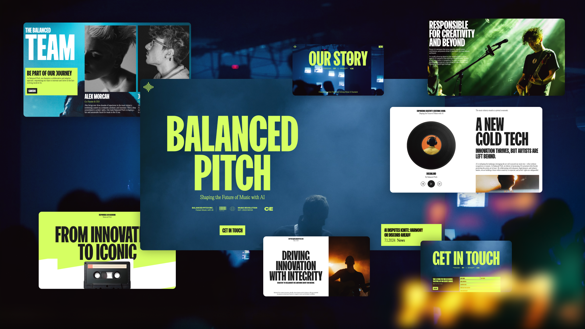

# Balanced Pitch - AI Ethics in Music Template



🌟 [🔗 LIVE DEMO](https://website-template-09-fxq4oq5sy-alexey9911s-projects.vercel.app) 🌟

👆 Click above to see the template in action!

A sophisticated AI ethics and music rights advocacy template built with React 18 and Vite 5, featuring smooth animations, parallax effects, and modern design principles. Perfect for advocacy organizations, AI ethics companies, music rights groups, and innovative organizations looking to showcase their mission with professional web presence.

## ✨ Features

- **Smooth Animations**: GSAP-powered animations with scroll triggers and custom easing
- **Parallax Effects**: Beautiful parallax scrolling images and content
- **Music Integration**: Custom music player component with controls
- **Responsive Design**: Fully optimized for all devices and screen sizes
- **Modern Typography**: Custom fonts and advanced text effects
- **Page Transitions**: Framer Motion powered route transitions
- **Smooth Scrolling**: React Lenis integration for buttery smooth scroll experience
- **Dynamic Content**: Multi-page application with React Router
- **Performance Optimized**: Fast loading with Vite build system
- **Professional Layout**: Clean, advocacy-focused design with attention to detail

## 🚀 Tech Stack

- **Framework**: React 18.3.1 with modern hooks and patterns
- **Build Tool**: Vite 5.4.10 for lightning-fast development and builds
- **Animations**: GSAP 3.12.5 for professional animation sequences
- **Motion**: Framer Motion 11.11.17 for page transitions and micro-interactions
- **Smooth Scrolling**: React Lenis 0.0.47 for hardware-accelerated smooth scrolling
- **Routing**: React Router 7.0.1 with dynamic route handling
- **Typography**: Custom fonts including PP Editorial New and FK Screamer
- **Performance**: Optimized components and lazy loading

## 📦 Installation

1. Clone the repository:
```bash
git clone https://github.com/Alexey9911/website-template-09.git
```

2. Navigate to the project directory:
```bash
cd website-template-09
```

3. Install dependencies:
```bash
npm install
```

4. Run the development server:
```bash
npm run dev
```

5. Open http://localhost:5173 in your browser.

## 🔧 Available Scripts

- `npm run dev` - Start development server with hot module replacement
- `npm run build` - Build for production with optimizations
- `npm run preview` - Preview production build locally
- `npm run lint` - Run ESLint for code quality checks

## 📁 Project Structure

```
balanced-pitch/
├── public/
│   ├── image1.png (Cover image)
│   ├── logo-dark.png
│   ├── logo.png
│   ├── site-icon.png
│   ├── stickers.png
│   ├── stickers-dark.png
│   └── stickers-light.png
├── src/
│   ├── assets/
│   │   └── fonts/
│   │       ├── fk-screamer.ttf
│   │       ├── pp-editorial-new-bold.ttf
│   │       ├── pp-editorial-new-heavy.ttf
│   │       ├── pp-editorial-new-regular.ttf
│   │       ├── pp-editorial-new-thin.ttf
│   │       └── pp-editorial-new-ultralight.ttf
│   ├── components/
│   │   ├── Footer/
│   │   │   ├── Footer.jsx
│   │   │   └── Footer.css
│   │   ├── Menu/
│   │   │   ├── Menu.jsx
│   │   │   └── Menu.css
│   │   ├── MusicPlayer/
│   │   │   ├── MusicPlayer.jsx
│   │   │   └── MusicPlayer.css
│   │   ├── ParallaxImage/
│   │   │   └── ParallaxImage.jsx
│   │   └── Transition/
│   │       ├── Transition.jsx
│   │       └── Transition.css
│   ├── pages/
│   │   ├── about/
│   │   │   ├── About.jsx
│   │   │   └── About.css
│   │   ├── contact/
│   │   │   ├── Contact.jsx
│   │   │   └── Contact.css
│   │   ├── home/
│   │   │   ├── Home.jsx
│   │   │   └── Home.css
│   │   ├── solutions/
│   │   │   ├── Solutions.jsx
│   │   │   └── Solutions.css
│   │   └── updates/
│   │       ├── Updates.jsx
│   │       └── Updates.css
│   ├── App.jsx
│   ├── App.css
│   ├── index.css
│   └── main.jsx
├── package.json
└── README.md
```

## 🎨 Customization

This template is designed to be easily customizable:

- **Content**: Update organization information, mission statements, and team members
- **Colors & Typography**: Modify CSS custom properties for brand consistency
- **Layout**: Responsive grid system adapts to your content structure
- **Animations**: Configure GSAP timelines and scroll triggers
- **Media**: Replace images with your own organizational content
- **Performance**: Adjust animation settings based on target devices

## 📱 Pages & Sections

### Home Page
- **Hero Section**: Compelling intro with parallax background and call-to-action
- **Mission Statement**: Organizational purpose and values
- **News Article**: Latest updates and announcements
- **Commitment Section**: Detailed mission explanation with imagery
- **Innovation Section**: Academic partnerships and collaborations
- **Latest Updates**: Featured articles and news
- **Footer**: Contact information and organizational details

### About Page
- **Our Story**: Organization history and mission
- **Sign-up Card**: Community engagement call-to-action
- **Team Section**: Team member profiles with detailed information
- **Values Marquee**: Animated scrolling organizational values
- **Services**: Detailed breakdown of organizational focus areas
- **Contact Banner**: Location and contact information

### Solutions Page
- **Hero Section**: Solutions overview with parallax imagery
- **Innovation Banner**: Mission-focused content
- **Features Grid**: Detailed solution breakdowns with numbered sections
- **Callout Section**: Responsibility and ethics messaging
- **AI Rights**: Rights advocacy information
- **Contact Section**: Solution-specific contact information

### Updates Page
- **Updates Hero**: Latest news and updates header
- **Filters**: Content categorization (hidden but available)
- **Articles Grid**: News articles with imagery and dates
- **Contact Banner**: Update-specific contact information

### Contact Page
- **Contact Form**: Professional contact form with validation
- **Organization Info**: Detailed contact and location information

## 🎯 Key Components

### ParallaxImage
- Smooth parallax scrolling effects
- Performance optimized for all devices
- Customizable speed and direction

### MusicPlayer
- Custom audio player with modern controls
- Responsive design with professional styling
- Integration with organizational content

### Menu Navigation
- Smooth page transitions
- Dynamic styling based on current route
- Mobile-responsive design

### Transition Wrapper
- Page transition animations
- Framer Motion powered effects
- Consistent user experience

## 🌐 Live Demo & Deployment

🚀 **[View Live Demo](https://website-template-09-fxq4oq5sy-alexey9911s-projects.vercel.app)**

See the template in action at the link above!

### Deploy Your Own

This project is optimized for deployment on Vercel:

1. Push your code to GitHub
2. Connect your GitHub repository to Vercel
3. Vercel will automatically detect Vite and configure build settings
4. Your site will be deployed with automatic updates on every push

[](https://vercel.com/new/clone?repository-url=https://github.com/Alexey9911/website-template-09)

### Manual Deployment Steps:

1. Build the project:
```bash
npm run build
```

2. Preview the build:
```bash
npm run preview
```

## 🎯 Performance Features

- **Modern Build System**: Vite 5 for fast development and optimized production builds
- **Component Architecture**: Modular React components for maintainability
- **Asset Optimization**: Optimized images and efficient loading strategies
- **Smooth Animations**: Hardware-accelerated animations with proper cleanup
- **Responsive Design**: Mobile-first approach with efficient breakpoints
- **Code Splitting**: Dynamic imports for optimal loading performance

## 🎨 Design Philosophy

Balanced Pitch embodies the philosophy of "Ethical AI, Creative Rights" focusing on:

- **Professional Advocacy**: Clean, modern design demonstrates organizational credibility
- **Mission Communication**: Clear presentation of values and goals
- **Community Engagement**: Interactive elements encourage participation
- **Educational Content**: Informative sections promote awareness
- **Transparency**: Open communication about organizational activities
- **Innovation**: Modern web technologies reflect forward-thinking approach

## 🌍 Organizational Focus

Showcasing commitment to:

- **Artists' Rights**: Protecting creative ownership in the AI era
- **Ethical AI**: Promoting responsible artificial intelligence practices
- **Education**: Academic partnerships and knowledge sharing
- **Innovation**: Balancing technology advancement with creator protection
- **Community**: Building networks of artists, educators, and technologists
- **Transparency**: Open dialogue about AI and music industry practices

## 🎵 Interactive Elements

- **Custom Music Player**: Professional audio integration
- **Parallax Scrolling**: Engaging visual experiences
- **Smooth Animations**: GSAP-powered professional effects
- **Navigation Transitions**: Seamless page changes
- **Hover Effects**: Interactive UI elements
- **Scroll Triggers**: Content reveals as you navigate

## 📄 License

This project is open source and available under the MIT License.

## 🤝 Contributing

Contributions, issues, and feature requests are welcome! Feel free to check the issues page.

## ⭐ Show your support

Give a ⭐️ if this project helped you create an amazing advocacy website!

Built with ❤️ using React, Vite, GSAP, and modern web technologies.

## 🔗 Links

- **Live Demo**: https://website-template-09-fxq4oq5sy-alexey9911s-projects.vercel.app
- **Repository**: https://github.com/Alexey9911/website-template-09
- **Deploy on Vercel**: https://vercel.com/new/clone?repository-url=https://github.com/Alexey9911/website-template-09

Transform your advocacy organization's digital presence with Balanced Pitch.
